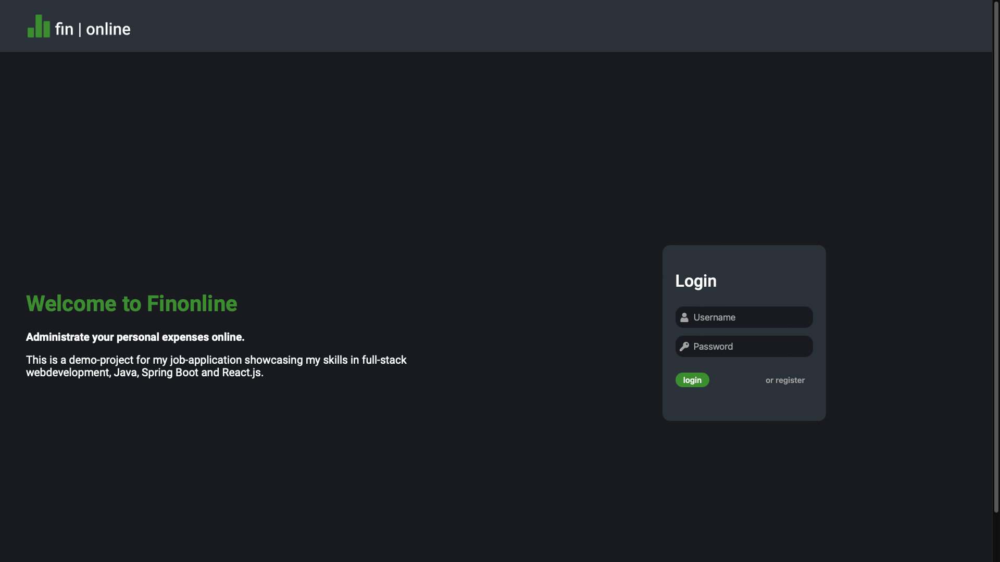

# Finonline - Demoproject
Register an account on Finonline and start managing your own personal finances. Add expense categories and input your expense- and revenue-streams. Analyse the status of your personal finance using the dynamic charts.

This project is a demo-project for showcasing my skills in full-stack development.

**Used skills (i.a):**
- HTML
- CSS/SASS
- Javascript/Typescript
- ReactJS
- Java (Spring boot)
- SQL/PSQL
- REST-API

## Local deployment
Follow instructions to deploy this project on your local machine.

**Prerequisites:**
- Node/NPM
- Java JDK v.17
- Maven
- PSQL
- Unix/*nix OS

**Installment:**
```
echo 1. Cloning github repository.
git clone https://github.com/NielDuysters/finonline.git
cd finonline

echo 2. Creating PSQL-database. Replace postgres with correct username.
createdb -U postgres finonline

echo 3. Importing database.
psql -U postgres finonline < psql-database/finonline_db.pgsql

echo 4. Installing node modules.
cd reactjs-frontend
npm install
```

**Run Java-spring-boot-backend:**
```
cd java-spring-boot-backend
mvn spring-boot:run
```

**Run Reactjs-frontend:**
```
cd reactjs-frontend
npm start
```

## Demovideo
[](https://www.youtube.com/watch?v=r9rK4HLisRY | width=100)

##Screenshots
Homepage


Add category popup


Table


Add cashflow form

